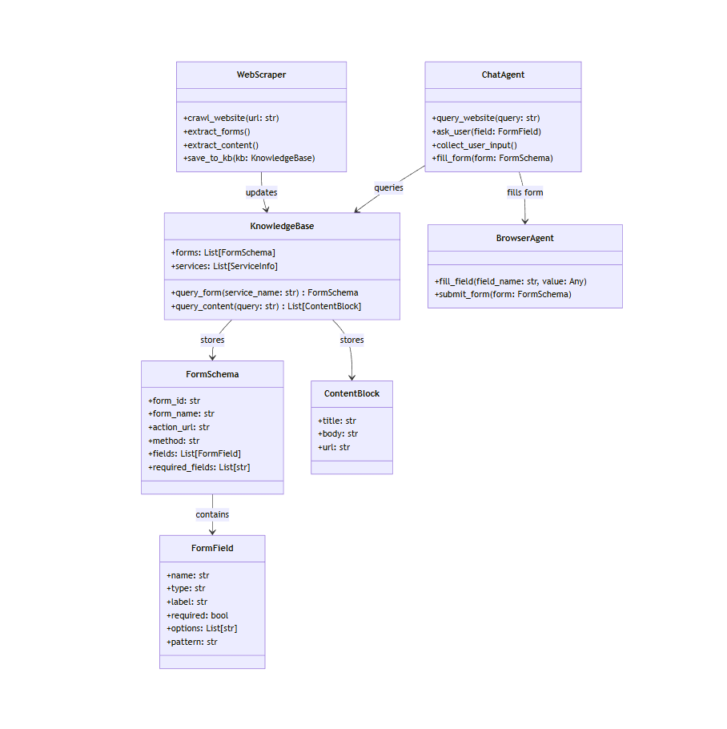
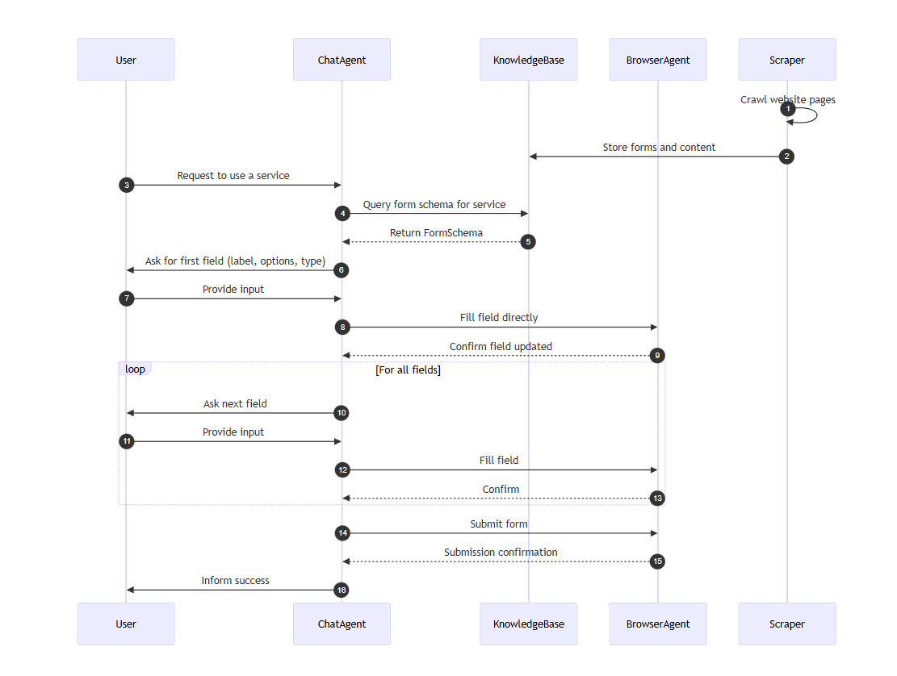

# Website Form-Filling & RAG Agent Architecture
This application serves two major purposes:

1. **RAG Chatbot:** Helps the user query and understand services of a website using the website’s content.
2. **Form-Filling Agent:** Fills and submits structured forms on the website based on user input.

All information (services, forms, and content) is dynamically extracted from the website using a scraper and stored in a structured **Knowledge Base (KB)**. The ChatAgent uses this KB to interact with the user and drive the BrowserAgent for filling forms.

---

## 1. Core Components

| Component | Responsibility |
|-----------|----------------|
| **WebScraper** | Crawl website, extract forms & content, and store in KB. |
| **KnowledgeBase (KB)** | Stores forms, website content, and service metadata. Used by ChatAgent for queries. |
| **FormSchema** | Represents a single form with all its fields, validation rules, and metadata. |
| **FormField** | Represents a single form field (name, type, label, options, required, pattern). |
| **ChatAgent** | Conversational interface: queries KB, asks user for field input, validates responses, and instructs BrowserAgent. |
| **BrowserAgent** | Interacts with the website DOM to fill fields and submit forms. |
| **ContentBlock** | Stores a block of website content for RAG queries. |

--- 
## 2. UML Class Diagram


---
## 3. Sequence Diagram


---

## 4. Data Storage Schema
#### FormSchema
```json
{
  "form_id": "tree_felling_001",
  "form_name": "Tree Felling Permission",
  "action_url": "https://aranya.gov.in/fellingform/submit",
  "method": "POST",
  "fields": [
    {"name": "district", "type": "dropdown", "label": "District", "required": true, "options": ["Bengaluru", "Mysuru", ...]},
    {"name": "applicant_name", "type": "text", "label": "Applicant Name", "required": true},
    ...
  ],
  "required_fields": ["district", "applicant_name", ...]
}
```

#### ContentBlock
```json
{
  "title": "Forest Services",
  "body": "The website provides services such as tree felling, fire permits...",
  "url": "https://aranya.gov.in/aranyacms/Home.aspx"
}
```

--- 
## 5. Workflow
1. **Scraper** crawls the website and extracts:
    * All forms (fields,options,validation rules)
    * Website content for knowledge retrieval
2. **KnowledgeBase** stores structured forms (``FormSchema``) and content (``ContentBlock``)
3. **ChatAgent** receives user query or request for a service
    a. **ChatAgent** queries KB to find the relevant form
        For each field in ``FormSchema``
            * Asks the user input
            * Validates input
            * Sends input to ``BrowserAgent`` to fill the website form
        Once all fields are filled, ``BrowserAgent`` submits the form
        **ChatAgent** confirms successful submission
    b. **ChatAgent** queries ContentBase to answer question.

---
## 6. Benefits of this architecture
1. **Scalable** : Can suport multiple forms, websites and languages
2. **Modular** : Scraper, KB, ChatAgent, and BrowserAgent are seperate
3. **Dynamic** : Works for any website without hardcoding individual agents
4. **Extensible** : Can add multi-page forms, advanced validation, and RAG queries