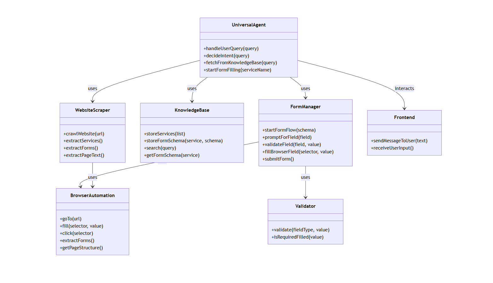
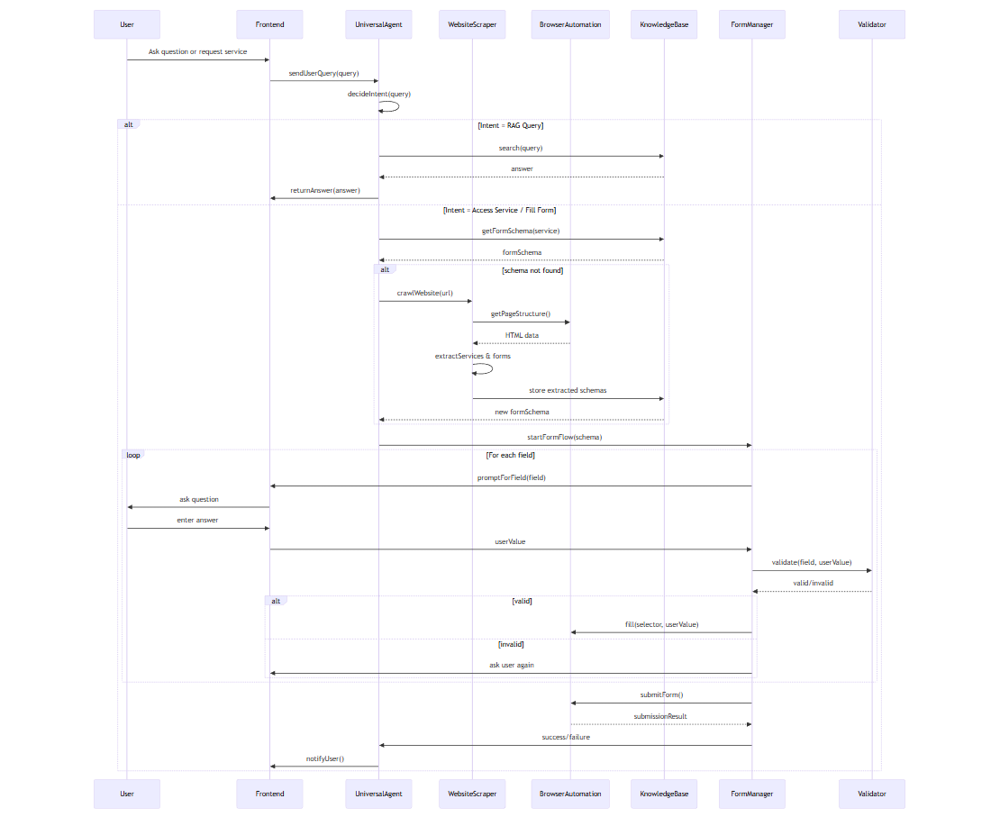

# Website Form-Filling & RAG Agent Architecture
This application serves two major purposes:

1. **RAG Chatbot:** Interprets user questions about website services using content extracted directly from the site.
2. **Form-Filling Agent:** Interacts with the website’s forms, collects required inputs from the user, fills fields in the browser, and submits them.

All data—services, text content, and form definitions—is dynamically extracted by a scraper and stored in a structured **Knowledge Base (KB)**. The **ChatAgent** uses this KB to interact with the user and drive the **BrowserAgent** for filling forms.

---

## 1. Core Components

| Component | Responsibility |
|-----------|----------------|
| **UnifiedAgent** | Central orchestrator. Handles user queries, retrieves answers from KB, identifies form tasks, and triggers pipelines. |
| **WebScraper** | Crawls any given website, extracts text, forms, metadata, links; normalizes content; sends data to KB. |
| **PageScraper** | Extracts raw text, titles, and link structure from each page. |
| **FormScraper** | Detects forms on a page, extracts fields (input, select, textarea), identifies validation rules, generates structured FormSchema. |
| **SchemaInference** | Cleans the raw scraped form structure, infers missing info (labels, types, constraints), generates final FormSchema objects. |
| **FormSchema** | Represents a complete form: fields, form action URL, method, layout, validation rules. |
| **FormField** | Represents a single form field: name, type, label, placeholder, options, required flag, regex pattern. |
| **KnowledgeBase (KB)** | Persistent storage layer containing PageContent, FormSchemas, embeddings, and site metadata for RAG + form automation. |
| **VectorStore** | Stores embeddings generated from website text; used for semantic RAG search and question answering. |
| **ContentBlock** | Represents a chunk of text extracted from website pages; used for RAG. |
| **IngestionPipeline** | Full data pipeline: Crawl → Scrape Pages → Extract Forms → Generate Schemas → Chunk Content → Embed → Store. |
| **ChatAgent** | Conversational interface using KB + VectorStore; answers user questions about the site’s content and guides form filling. |
| **BrowserAgent** | Controls the browser: navigates pages, finds the DOM nodes, fills fields, selects dropdowns, clicks submit. Uses Playwright/LiveKit. |
| **FormFillPipeline** | End-to-end workflow: interpret form → ask user for values → validate → direct BrowserAgent to fill the form. |
| **Logger** | Unified logging for scraping, KB operations, pipelines, and browser tasks. |


--- 
## 2. UML Class Diagram


---
## 3. Sequence Diagram


---

## 4. Data Storage Schema
#### FormSchema
```json
{
  "form_id": "tree_felling_001",
  "form_name": "Tree Felling Permission",
  "action_url": "https://aranya.gov.in/fellingform/submit",
  "method": "POST",
  "fields": [
    {
      "name": "district",
      "type": "dropdown",
      "label": "District",
      "required": true,
      "options": ["Bengaluru", "Mysuru"]
    },
    {
      "name": "applicant_name",
      "type": "text",
      "label": "Applicant Name",
      "required": true
    }
  ],
  "required_fields": ["district", "applicant_name"]
}

```

#### ContentBlock
```json
{
  "title": "Forest Services",
  "body": "The website provides services such as tree felling permission, fire permits, etc.",
  "url": "https://aranya.gov.in/aranyacms/Home.aspx"
}

```
--- 
## 5. Workflow
1. **Scraper** crawls the website and extracts:
    * All forms (fields,options,validation rules)
    * Website content for knowledge retrieval
2. **KnowledgeBase** stores structured forms (``FormSchema``) and content (``ContentBlock``)
3. **ChatAgent** receives user query or request for a service
    a. **ChatAgent** queries KB to find the relevant form
        For each field in ``FormSchema``
            * Asks the user input
            * Validates input
            * Sends input to ``BrowserAgent`` to fill the website form
        Once all fields are filled, ``BrowserAgent`` submits the form
        **ChatAgent** confirms successful submission
    b. **ChatAgent** queries ContentBase to answer question.

---
## 6. Benefits of this architecture
1. **Scalable** : Can suport multiple forms, websites and languages
2. **Modular** : Scraper, KB, ChatAgent, and BrowserAgent are seperate
3. **Dynamic** : Works for any website without hardcoding individual agents
4. **Extensible** : Can add multi-page forms, advanced validation, and RAG queries